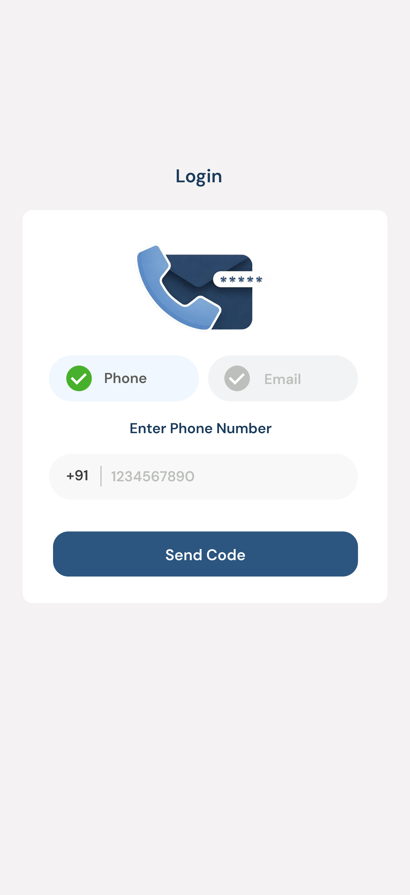
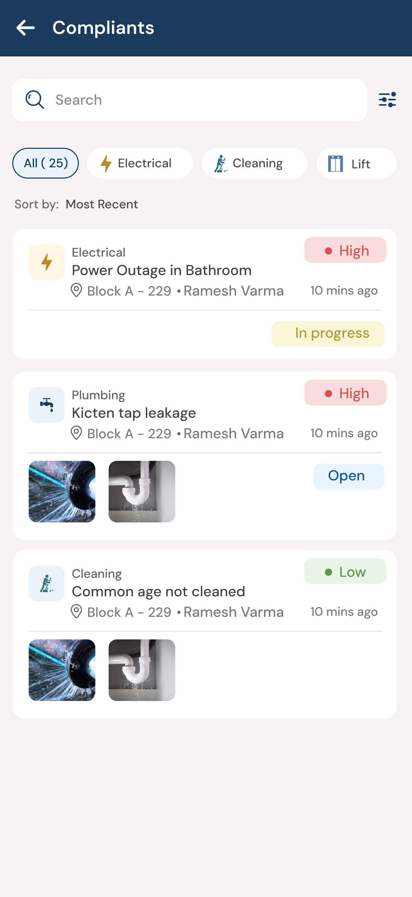
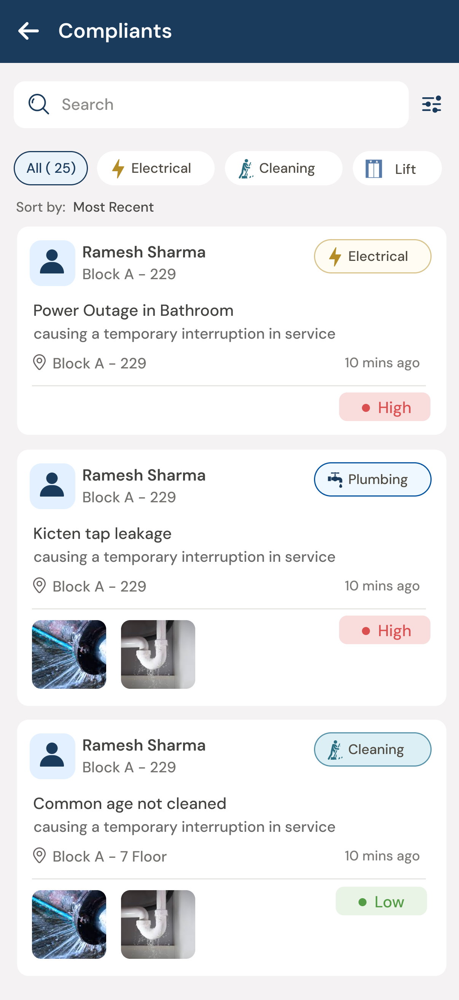
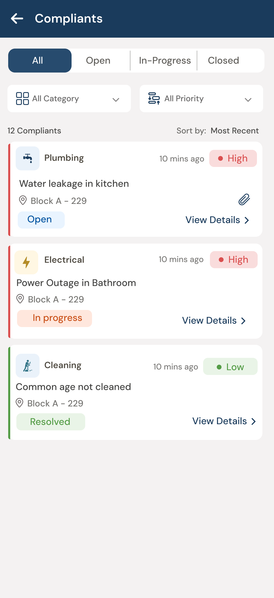

# MyGate-Ios-app
Apartment management iOS app built with UIKit, API integration, and modern UI design.

## ➕ login and Otp Verification Screen

  
  &nbsp;&nbsp;&nbsp;
  

## ➕ Raise Complaint Screen

  
  &nbsp;&nbsp;&nbsp;
  

## 🧠 Design Thinking

- Designed multiple UI versions for better user experience
- Compared category-based vs dropdown-based approach
- Selected final design based on simplicity and scalability
## ➕ Complaint List Screen

  
  &nbsp;&nbsp;
  
  &nbsp;&nbsp;
  

